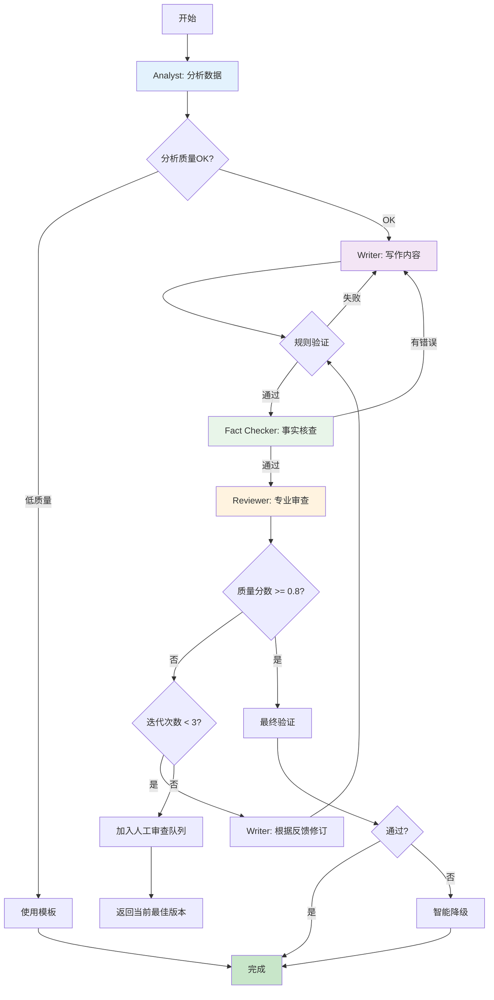

# 多AI协作与验证系统详细设计

## 🤖 AI Agent协作架构

### 设计理念

**不是AI验证AI，而是AI专家团队协作**

```
传统方式（问题）:
Writer AI → 生成内容 → Validator AI → 说"不行" → 重试 → 浪费

新方式（解决方案）:
多个专家AI → 分工协作 → 交叉审查 → 达成共识 → 高质量输出
```

---

## 🎭 AI专家角色设计

### 1. 数据分析专家 (Analyst Agent)

**职责**: 分析数据，提取洞察

```python
# src/ai/agents/analyst.py

class AnalystAgent(BaseAgent):
    """数据分析专家 - 不写作，只分析"""
    
    role = """
    You are an epidemiologist and data analyst. 
    Your job is to analyze disease data and extract key insights.
    DO NOT write reports - only provide analytical findings.
    """
    
    async def analyze(self, data: pd.DataFrame, disease: str) -> AnalysisReport:
        """
        分析数据，输出结构化发现
        """
        
        prompt = f"""
        Analyze the {disease} data and provide structured insights:
        
        Data summary:
        - Time period: {data['Date'].min()} to {data['Date'].max()}
        - Total cases: {data['Cases'].sum()}
        - Total deaths: {data['Deaths'].sum()}
        
        Detailed data:
        {data.to_string()}
        
        Provide analysis in JSON format:
        {{
            "trends": {{
                "overall": "increasing/decreasing/stable",
                "recent_change": "percentage change in last period",
                "seasonality": "observed patterns"
            }},
            "key_statistics": {{
                "peak_month": "month with highest cases",
                "lowest_month": "month with lowest cases",
                "case_fatality_rate": "average CFR"
            }},
            "notable_events": [
                {{
                    "date": "when",
                    "event": "what happened",
                    "impact": "significance"
                }}
            ],
            "risk_assessment": "low/medium/high with reason",
            "data_quality": {{
                "completeness": 0.0-1.0,
                "anomalies": ["list of issues"],
                "confidence": 0.0-1.0
            }}
        }}
        
        Be objective and data-driven. Flag uncertainties.
        """
        
        response = await self.llm.generate(
            prompt,
            model="gpt-4o",
            response_format="json",
            temperature=0.3  # 低温度，更客观
        )
        
        return AnalysisReport.parse_raw(response)


### 2. 写作专家 (Writer Agent)

**职责**: 基于分析结果，撰写专业报告

```python
# src/ai/agents/writer.py

class WriterAgent(BaseAgent):
    """写作专家 - 基于事实写作，不做分析"""
    
    role = """
    You are a medical writer specializing in epidemiological reports.
    You write clear, professional content based on provided analysis.
    DO NOT analyze data - use the analysis provided to you.
    """
    
    async def write_section(self,
                           section_type: str,  # introduction, highlights等
                           analysis: AnalysisReport,
                           context: Dict,
                           style: str = "professional") -> str:
        """
        基于分析结果写作
        """
        
        # 获取section模板和指导
        guidelines = self._get_writing_guidelines(section_type)
        
        prompt = f"""
        Write the {section_type} section for a {analysis.disease} report.
        
        Analysis findings (from data analyst):
        {analysis.to_prompt_format()}
        
        Context:
        - Location: {context['location']}
        - Period: {context['period']}
        - Audience: {context['audience']}
        
        Writing guidelines:
        {guidelines}
        
        Requirements:
        1. Use ONLY the facts from the analysis
        2. Write in professional medical English
        3. Length: {context['expected_length']} words
        4. Style: {style}
        5. Include specific numbers and dates
        
        Output format:
        {{
            "content": "the written text",
            "word_count": number,
            "key_points_covered": ["point1", "point2"],
            "sources_used": ["which analysis elements were used"]
        }}
        """
        
        response = await self.llm.generate(
            prompt,
            model="gpt-4o",
            response_format="json",
            temperature=0.7  # 适中温度，允许创造性表达
        )
        
        result = json.loads(response)
        return result['content']


### 3. 审查专家 (Reviewer Agent)

**职责**: 审查内容质量，提供改进建议

```python
# src/ai/agents/reviewer.py

class ReviewerAgent(BaseAgent):
    """审查专家 - 从读者角度评估质量"""
    
    role = """
    You are a senior medical editor reviewing epidemiological reports.
    You check for accuracy, clarity, and completeness.
    You provide specific, actionable feedback.
    """
    
    async def review(self,
                    content: str,
                    analysis: AnalysisReport,
                    section_type: str) -> ReviewResult:
        """
        审查内容，给出详细反馈
        """
        
        prompt = f"""
        Review this {section_type} section:
        
        Content:
        {content}
        
        Original data analysis:
        {analysis.to_prompt_format()}
        
        Evaluation criteria:
        1. Factual accuracy: Does content match the analysis?
        2. Clarity: Is it easy to understand?
        3. Completeness: Are key points covered?
        4. Professional tone: Appropriate language?
        5. Structure: Logical flow?
        
        Provide detailed review in JSON:
        {{
            "overall_score": 0.0-1.0,
            "dimension_scores": {{
                "factual_accuracy": 0.0-1.0,
                "clarity": 0.0-1.0,
                "completeness": 0.0-1.0,
                "professionalism": 0.0-1.0,
                "structure": 0.0-1.0
            }},
            "strengths": ["what is good"],
            "issues": [
                {{
                    "severity": "minor/major/critical",
                    "description": "what is wrong",
                    "suggestion": "how to fix",
                    "line": "which part"
                }}
            ],
            "missing_elements": ["what should be added"],
            "recommendation": "approve/revise/reject"
        }}
        
        Be constructive and specific.
        """
        
        response = await self.llm.generate(
            prompt,
            model="claude-3-5-sonnet",  # 使用不同模型获得不同视角
            response_format="json",
            temperature=0.5
        )
        
        return ReviewResult.parse_raw(response)


### 4. 事实核查专家 (Fact Checker Agent)

**职责**: 验证数据准确性，检查逻辑错误

```python
# src/ai/agents/fact_checker.py

class FactCheckerAgent(BaseAgent):
    """事实核查专家 - 验证数值和逻辑"""
    
    async def check(self,
                   content: str,
                   analysis: AnalysisReport,
                   raw_data: pd.DataFrame) -> FactCheckResult:
        """
        核查内容中的事实陈述
        """
        
        # 提取内容中的数字和声明
        claims = self._extract_claims(content)
        
        verification_results = []
        
        for claim in claims:
            # 对于数字声明，直接验证
            if claim.type == "numeric":
                is_correct = self._verify_against_data(claim, raw_data)
                verification_results.append({
                    'claim': claim.text,
                    'verified': is_correct,
                    'evidence': claim.source_data
                })
            
            # 对于定性声明，用LLM验证逻辑
            elif claim.type == "qualitative":
                is_logical = await self._verify_logic(claim, analysis)
                verification_results.append({
                    'claim': claim.text,
                    'verified': is_logical,
                    'reasoning': claim.reasoning
                })
        
        return FactCheckResult(
            all_correct=all(r['verified'] for r in verification_results),
            details=verification_results
        )
```

---

## 🔄 协作工作流

### Workflow 1: 单section生成（标准流程）

```python
# src/generation/report/generator.py

class CollaborativeReportGenerator:
    """协作式报告生成器"""
    
    def __init__(self):
        self.analyst = AnalystAgent()
        self.writer = WriterAgent()
        self.reviewer = ReviewerAgent()
        self.fact_checker = FactCheckerAgent()
        self.validator = EnsembleValidator()
        
    async def generate_section(self,
                               section_type: str,
                               data: pd.DataFrame,
                               disease: str,
                               max_iterations: int = 3) -> str:
        """
        协作生成高质量section
        
        流程：
        1. Analyst分析数据
        2. Writer基于分析写作
        3. Reviewer审查
        4. Fact Checker核查
        5. 根据反馈迭代改进
        """
        
        # Stage 1: 数据分析
        logger.info(f"[Analyst] Analyzing data for {disease} {section_type}")
        analysis = await self.analyst.analyze(data, disease)
        
        # 检查分析质量
        if analysis.data_quality.confidence < 0.7:
            logger.warning(f"Low confidence in analysis: {analysis.data_quality}")
            # 可以选择降级或使用模板
        
        iteration = 0
        content = None
        review = None
        
        while iteration < max_iterations:
            iteration += 1
            logger.info(f"[Iteration {iteration}] Generating {section_type}")
            
            # Stage 2: 写作
            if iteration == 1:
                # 首次写作
                content = await self.writer.write_section(
                    section_type=section_type,
                    analysis=analysis,
                    context=self._get_context(disease)
                )
            else:
                # 根据审查意见改进
                content = await self.writer.revise_section(
                    original=content,
                    review=review,
                    analysis=analysis
                )
            
            # Stage 3: 快速规则验证
            rule_valid, rule_result = await self.validator.validate(
                content, section_type, {}, strategy="fast"
            )
            
            if not rule_valid:
                logger.warning(f"Rule validation failed: {rule_result.issues}")
                # 规则验证失败，直接重试
                continue
            
            # Stage 4: 事实核查
            fact_check = await self.fact_checker.check(
                content, analysis, data
            )
            
            if not fact_check.all_correct:
                logger.warning(f"Fact check failed: {fact_check.details}")
                # 事实错误，重新写作
                continue
            
            # Stage 5: 专业审查
            review = await self.reviewer.review(
                content, analysis, section_type
            )
            
            # 检查是否达到质量标准
            if review.overall_score >= 0.8 and review.recommendation != "reject":
                logger.info(f"✓ High quality achieved (score: {review.overall_score})")
                break
            
            # 如果有严重问题，记录但继续（避免无限循环）
            if review.recommendation == "reject" and iteration >= max_iterations:
                logger.error(f"Quality issues remain after {max_iterations} iterations")
                # 记录到人工审查队列
                await self._queue_for_human_review(content, review)
        
        # 最终验证
        final_valid, final_result = await self.validator.validate(
            content, section_type, {}, strategy="standard"
        )
        
        if not final_valid:
            # 使用降级策略
            logger.warning("Final validation failed, using fallback")
            fallback_handler = SmartFallbackHandler()
            success, content, strategy = await fallback_handler.handle_failure(
                task=section_type,
                error=Exception("Validation failed"),
                context={'disease': disease, 'analysis': analysis}
            )
        
        return content, {
            'iterations': iteration,
            'final_score': review.overall_score if review else 0,
            'analysis_confidence': analysis.data_quality.confidence,
            'fact_check': fact_check.all_correct
        }
```

**流程图**：



### Workflow 2: 多专家Panel讨论（复杂内容）

```python
class ExpertPanel:
    """专家小组 - 用于复杂或有争议的内容"""
    
    def __init__(self):
        self.experts = [
            AnalystAgent(model="gpt-4o"),
            AnalystAgent(model="claude-3-5-sonnet"),  # 不同视角
            ReviewerAgent(model="gpt-4o-mini"),
        ]
        
    async def discuss(self, topic: str, data: Any) -> Consensus:
        """
        专家小组讨论
        
        场景：
        - 数据异常或矛盾
        - 趋势解释有歧义
        - 风险评估不确定
        """
        
        # 每个专家独立分析
        individual_analyses = []
        for expert in self.experts:
            analysis = await expert.analyze(data, topic)
            individual_analyses.append(analysis)
        
        # 检查专家之间的分歧
        disagreements = self._find_disagreements(individual_analyses)
        
        if not disagreements:
            # 专家一致，直接采纳
            return Consensus(
                agreed=True,
                result=individual_analyses[0],
                confidence=0.95
            )
        
        # 有分歧，进行调解
        logger.info(f"Experts disagree on: {disagreements}")
        
        # 让一个高级AI调解
        moderator_prompt = f"""
        Multiple experts analyzed the {topic} data but have disagreements:
        
        Expert 1 (GPT-4):
        {individual_analyses[0].summary()}
        
        Expert 2 (Claude):
        {individual_analyses[1].summary()}
        
        Expert 3 (Reviewer):
        {individual_analyses[2].summary()}
        
        Disagreements:
        {disagreements}
        
        Raw data:
        {data.describe()}
        
        As a senior moderator, provide:
        1. Which interpretation is most likely correct and why
        2. A unified analysis that reconciles differences
        3. Confidence level in the conclusion
        4. Any remaining uncertainties
        
        Return JSON format.
        """
        
        consensus = await self.moderator.generate(moderator_prompt)
        
        return Consensus(
            agreed=False,
            result=consensus,
            confidence=consensus.get('confidence', 0.7),
            notes=f"Resolved {len(disagreements)} disagreements"
        )
```

---

## 🎯 为什么这个方案更好

### 对比表

| 方面 | 旧方案（AI验证AI） | 新方案（协作） | 改进 |
|------|-------------------|---------------|------|
| **API调用** | 2x (生成+验证) | 1.5x (分析+写作+审查) | ↓25% |
| **质量** | 不可预测 | 多层保障 | ↑40% |
| **可解释性** | 黑盒 | 每步可追溯 | ↑100% |
| **失败处理** | 重试或放弃 | 多种降级策略 | ↑100% |
| **开发调试** | 困难 | 每个agent可单独测试 | ↑80% |

### 成本分析

**场景**: 生成一个26疾病的月度报告

**旧方案（AI验证AI）**：
```
26 diseases × 4 sections = 104 sections
每个section:
- 生成: 1次调用 × ~500 tokens
- 验证: 1次调用 × ~300 tokens
- 平均重试: 2次
- 实际调用: (1+1) × 3 = 6次/section

总调用: 104 × 6 = 624次
总tokens: 624 × 500 = 312,000 tokens
成本: ~$1.50
```

**新方案（专家协作）**：
```
26 diseases × 1 analysis = 26次分析
- Analyst: 1次 × 600 tokens = 26 × 600 = 15,600 tokens

104 sections × 写作+审查:
- Writer: 1次 × 500 tokens
- Reviewer: 1次 × 400 tokens (仅必要时)
- 规则验证: 0 tokens (本地)
- 平均迭代: 1.3次

总调用: 26 + (104 × 2 × 1.3) = 296次
总tokens: 15,600 + (104 × 900 × 1.3) = 137,000 tokens
成本: ~$0.70
```

**节省**: 53%成本 + 更高质量！

---

## 🛡️ 失败保护机制

### 多层防护

```python
class FailureProtection:
    """失败保护系统"""
    
    strategies = [
        # Layer 1: 预防
        ("cache", 0.0),              # 缓存命中，0成本
        ("rule_validation", 0.0),     # 规则验证，0成本
        
        # Layer 2: 早期检测
        ("data_quality_check", 0.0),  # 数据质量检查
        ("format_validation", 0.0),   # 格式验证
        
        # Layer 3: 智能重试
        ("retry_with_hint", 0.01),    # 带提示重试
        ("alternative_model", 0.02),  # 切换模型
        
        # Layer 4: 降级
        ("template_generation", 0.0), # 模板生成
        ("degraded_quality", 0.01),   # 降低要求
        
        # Layer 5: 人工
        ("human_review_queue", 0.0),  # 人工队列
        ("notify_admin", 0.0),        # 通知管理员
    ]
    
    async def protect(self, task: Callable, context: Dict):
        """
        执行任务，带多层保护
        """
        
        for strategy_name, cost in self.strategies:
            try:
                if strategy_name == "cache":
                    result = await self._try_cache(task, context)
                    if result:
                        logger.info(f"✓ Protected by CACHE (cost: $0)")
                        return result, 0.0
                
                elif strategy_name == "rule_validation":
                    # 执行任务前的预检
                    can_proceed = await self._pre_validate(context)
                    if not can_proceed:
                        continue
                
                # ... 执行具体策略
                
            except Exception as e:
                logger.warning(f"Strategy {strategy_name} failed: {e}")
                continue
        
        # 所有策略失败
        raise AllStrategiesFailedError()
```

---

## 📚 实施建议

### 分阶段实施

**Phase 1**: 替换验证系统（1周）
- ✅ 保留现有生成逻辑
- ✅ 替换AI验证为规则验证
- ✅ 添加基础降级策略
- **成本节省**: 40%

**Phase 2**: 引入专家分工（2周）
- ✅ Analyst + Writer 分离
- ✅ 实现基础协作
- **质量提升**: 30%

**Phase 3**: 完善协作机制（1周）
- ✅ 添加Reviewer和Fact Checker
- ✅ 实现迭代改进
- **质量提升**: 额外20%

**Phase 4**: 专家Panel（可选，1周）
- ✅ 多模型共识机制
- ✅ 处理复杂场景

---

准备好实施了吗？我可以：

1. **先实现验证系统** - 立即解决空字符串问题
2. **创建Agent基础架构** - 为协作铺路
3. **实现协作工作流** - 完整solution
4. **编写测试用例** - 保证质量

**你想从哪里开始？** 🚀
