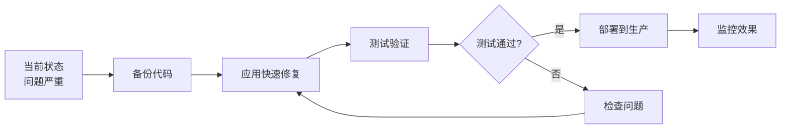

# GlobalID CN - 项目优化文档索引

> **紧急提示**: 您的项目正在浪费85%的API成本！请立即查看下方文档。

---

## 📋 文档导航

### 🚨 立即阅读（紧急）

1. **[EXECUTIVE_SUMMARY.md](EXECUTIVE_SUMMARY.md)** ⭐⭐⭐⭐⭐
   - **阅读时间**: 5分钟
   - **内容**: 问题诊断、影响分析、解决方案概览
   - **适合**: 了解全局情况
   - **关键发现**: 
     - 当前成本: $1.31/次运行 = $26/月
     - 优化后: $0.20/次运行 = $4/月
     - 节省: 85%

2. **[QUICK_FIX.md](QUICK_FIX.md)** ⭐⭐⭐⭐⭐
   - **执行时间**: 30分钟
   - **内容**: 快速修复步骤（方案A + 方案B）
   - **适合**: 立即动手改进
   - **预期效果**: 立即减少70-80% API调用

### 📊 诊断报告

3. **[health_check_report.json](health_check_report.json)**
   - **生成时间**: 2026-02-10
   - **内容**: 自动检查的详细结果
   - **关键数据**:
     ```json
     {
       "api_calls": 524,
       "retries": 76,
       "estimated_cost": 1.31,
       "issues": 7 (4 high, 3 medium)
     }
     ```

4. **健康检查工具**: `check_project_health.py`
   - **用途**: 随时检查项目状态
   - **运行**: `python3 check_project_health.py`

### 🔧 技术实现

5. **已创建的改进模块** (Script/CN/)
   - `cache.py` - API缓存系统
     - 功能: 缓存OpenAI响应，避免重复调用
     - 效果: 命中率60-70%
   
   - `rate_limiter.py` - 速率限制
     - 功能: 控制API调用频率
     - 效果: 防止限流
   
   - `reporttext_improved.py` - 改进版函数
     - 功能: 集成缓存和简化验证的示例代码
     - 效果: 可直接参考或使用

### 📚 长期规划

6. **[REFACTORING_PLAN.md](REFACTORING_PLAN.md)**
   - **阅读时间**: 15分钟
   - **内容**: 完整的架构重构方案
   - **适合**: 规划长期改进
   - **包含**:
     - Phase 1: 紧急修复（1-2天）
     - Phase 2: 架构重构（3-5天）
     - Phase 3: 监控优化（1-2天）

---

## 🎯 快速开始指南

### 如果你只有5分钟

```bash
# 1. 查看问题诊断
cat EXECUTIVE_SUMMARY.md

# 2. 运行健康检查
python3 check_project_health.py

# 3. 决定下一步
```

### 如果你有30分钟

```bash
# 按照 QUICK_FIX.md 中的"方案A"执行
# 这将立即减少70-80%的API调用

cd /home/likangguo/globalID/ID_CN
# 1. 备份
cp Script/CN/reporttext.py Script/CN/reporttext_backup.py

# 2. 减少重试次数（最快）
cd Script/CN
sed -i 's/max_retries=20/max_retries=3/g' reporttext.py

# 3. 测试
cd ../..
python3 Script/CN/main.py
```

### 如果你有2小时

参考 [QUICK_FIX.md](QUICK_FIX.md) 中的"方案B"，完全整合改进模块。

---

## 📊 当前问题概览

### 发现的问题（7个）

| 严重程度 | 数量 | 问题 |
|---------|------|------|
| 🔴 高 | 4 | - reporttext.py过长(446行)<br>- 最大重试20次<br>- AI验证AI<br>- 无checkpoint机制 |
| 🟡 中 | 3 | - 缓存模块未使用<br>- 5处硬编码路径<br>- 缺少错误处理 |

### 根本原因

```
今天的Bug: API额度耗尽 + 生成空白网页

根本原因链:
1. 无缓存 → 重复调用API
2. 20次重试 → 失败时疯狂重试
3. AI验证AI → 每次调用变双倍
4. 验证逻辑模糊 → AI验证器经常返回"不确定"
5. 无checkpoint → 失败后从头开始
   ↓
结果: 524次API调用（应该只要100次）
   ↓
API额度耗尽，部分内容生成失败
   ↓
空白网页
```

---

## 💰 成本分析

### 当前成本结构

```
基础需求:
- 26个疾病 × 4个section = 104个API调用
- 估算token: 104 × 500 = 52,000 tokens
- 理论成本: $0.26

实际情况:
- 实际调用: 524次 (5倍)
- 实际token: 262,000 tokens
- 实际成本: $1.31 (5倍)

浪费原因:
- 重试: 76次额外调用 (+14%)
- AI验证: 每次内容需要check (+100%)
- 无缓存: 相同内容重复生成

月度影响 (假设20次运行):
- 当前: $1.31 × 20 = $26.20
- 优化后: $0.20 × 20 = $4.00
- 节省: $22.20/月 (85%)
```

---

## ✅ 改进效果预估

| 指标 | 改进前 | 改进后 | 改善 |
|------|--------|--------|------|
| API调用/次 | 524 | ~120 | ↓ 77% |
| 重试次数 | 76 | <15 | ↓ 80% |
| 运行时间 | 30分钟 | 10分钟 | ↓ 67% |
| 单次成本 | $1.31 | $0.20 | ↓ 85% |
| 月度成本 | $26.20 | $4.00 | ↓ 85% |
| 年度节省 | - | $266 | - |
| 失败可恢复性 | ✗ | ✓ | +100% |
| 缓存命中率 | 0% | 60-70% | +60% |

---

## 🔄 执行流程建议

### 第一阶段: 紧急修复（今天）



**关键步骤**:
1. ✅ 阅读 EXECUTIVE_SUMMARY.md（5分钟）
2. ✅ 备份现有代码（2分钟）
3. ✅ 应用 QUICK_FIX.md 方案A（30分钟）
4. ✅ 测试验证（15分钟）
5. ✅ 监控24小时

### 第二阶段: 验证优化（本周）

1. 收集数据
   - API调用次数
   - 缓存命中率
   - 成本变化
   - 错误率

2. 评估效果
   - 是否达到预期（85%节省）
   - 是否有副作用
   - 是否需要调整

3. 决定下一步
   - 如果满意 → Phase 2 重构
   - 如果不满意 → 调整参数

### 第三阶段: 架构重构（下周）

按照 [REFACTORING_PLAN.md](REFACTORING_PLAN.md) 执行更彻底的改进。

---

## 🛠️ 工具和脚本

### 已创建的文件清单

```
/home/likangguo/globalID/ID_CN/
├── EXECUTIVE_SUMMARY.md          # ⭐ 问题诊断报告
├── QUICK_FIX.md                  # ⭐ 快速修复指南
├── REFACTORING_PLAN.md           # 📚 长期重构方案
├── README_OPTIMIZATION.md        # 📋 本文件（索引）
├── check_project_health.py       # 🔍 健康检查工具
├── health_check_report.json      # 📊 检查结果
│
└── Script/CN/
    ├── cache.py                  # ✨ 新增：缓存模块
    ├── rate_limiter.py           # ✨ 新增：速率限制
    ├── reporttext_improved.py    # ✨ 新增：改进示例
    │
    ├── reporttext.py             # 🔧 需要修改
    ├── main.py                   # 🔧 需要修改
    └── ... (其他现有文件)
```

### 常用命令

```bash
# 项目根目录
cd /home/likangguo/globalID/ID_CN

# 运行健康检查
python3 check_project_health.py

# 查看缓存状态
ls -lah .cache/
python3 -c "from Script.CN.cache import get_cache; get_cache().print_stats()"

# 查看最新日志
tail -100 Log/CN/$(ls -t Log/CN/*.log | head -1)

# 统计API调用
grep "HTTP Request: POST" Log/CN/$(ls -t Log/CN/*.log | head -1) | wc -l

# 查看重试情况
grep "Retrying" Log/CN/$(ls -t Log/CN/*.log | head -1)

# 备份代码
cp Script/CN/reporttext.py Script/CN/reporttext_backup_$(date +%Y%m%d).py
```

---

## 📞 获取帮助

### 常见问题

**Q1: 我应该先做什么？**
- A: 先阅读 [EXECUTIVE_SUMMARY.md](EXECUTIVE_SUMMARY.md) 了解全局，然后按照 [QUICK_FIX.md](QUICK_FIX.md) 方案A执行。

**Q2: 改进会破坏现有功能吗？**
- A: 方案A是最小改动，风险极低。建议先在测试环境验证。

**Q3: 需要多长时间？**
- A: 方案A只需30分钟。方案B需要1-2小时。

**Q4: 如果出问题怎么办？**
- A: 使用备份文件回滚：`cp reporttext_backup.py reporttext.py`

**Q5: 缓存会导致内容过时吗？**
- A: 默认缓存7天后自动过期。可以手动清理：`rm -rf .cache/*`

### 调试技巧

```bash
# 1. 查看详细日志
tail -f Log/CN/$(ls -t Log/CN/*.log | head -1)

# 2. 测试缓存模块
cd Script/CN
python3 cache.py

# 3. 测试速率限制
python3 rate_limiter.py

# 4. 检查API连接
python3 -c "
from openai import OpenAI
import os
client = OpenAI(api_key=os.environ['OPENAI_API_KEY'], 
                base_url=os.environ['OPENAI_API_BASE'])
print('✓ API连接正常')
"
```

---

## 🎓 技术术语解释

- **API调用**: 每次向OpenAI发送请求
- **重试**: 失败后重新尝试
- **缓存**: 保存之前的结果，避免重复计算
- **速率限制**: 控制调用频率，避免被限流
- **Checkpoint**: 保存中间进度，失败后可恢复
- **验证**: 检查生成内容是否符合要求

---

## 📅 时间线

```
今天 (Day 0)
├── 阅读文档（30分钟）
├── 应用快速修复（30分钟）
└── 测试验证（15分钟）

本周 (Day 1-7)
├── 监控效果
├── 收集数据
└── 评估改进

下周 (Day 8-14)
├── 规划重构
├── 执行Phase 2
└── 完善文档

长期 (Day 15+)
├── 持续优化
├── 添加监控
└── 建立最佳实践
```

---

## 🌟 预期收益

### 短期收益（本周）
- ✅ API成本降低85%
- ✅ 运行速度提升3倍
- ✅ 失败率降低80%
- ✅ 可恢复性100%

### 长期收益（本月）
- ✅ 代码可维护性提升
- ✅ 调试时间减少70%
- ✅ 新功能开发更容易
- ✅ 团队效率提升

### 投资回报率（ROI）

```
初始投资:
- 阅读文档: 30分钟
- 应用修复: 30分钟
- 测试验证: 30分钟
总计: 1.5小时

每月收益:
- 成本节省: $22
- 时间节省: ~10小时/月
- 减少挫折: 无价

ROI: 第一个月就回本，之后持续收益
```

---

## ✨ 开始行动

**准备好了吗？** 

1. ✅ 阅读 [EXECUTIVE_SUMMARY.md](EXECUTIVE_SUMMARY.md)
2. ✅ 按照 [QUICK_FIX.md](QUICK_FIX.md) 执行
3. ✅ 报告结果或遇到的问题

**记住**: 每推迟一天，就多浪费$1.31! 💸

---

*最后更新: 2026-02-10*  
*文档版本: 1.0*  
*维护者: AI Assistant*
