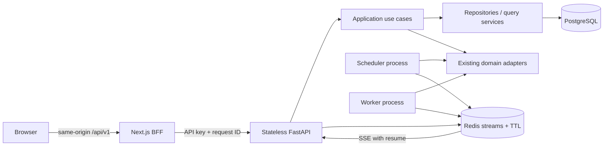

# Architecture

## Runtime topology

The control plane is a bounded context around the existing ingestion, disease, knowledge, report, release, and subscription services. Delivery routes validate HTTP input and call application use cases. SQL belongs to repositories/query services; orchestration belongs to application services; existing domain services remain the adapters for crawlers and publication workflows.

The API is stateless. It has no in-process scheduler loop and no in-process WebSocket fanout. The standalone scheduler owns ingestion, release, and mapping dispatch. Workers continue to atomically claim queued tasks. API, scheduler, and workers publish TTL heartbeats and a bounded Redis event stream.

## Contract and BFF

FastAPI OpenAPI drives a generated `openapi-fetch` client. The browser uses only relative `/api/v1` URLs. The Next.js Route Handler validates mutation Origin, removes hop-by-hop headers, forwards request IDs and streaming bodies, and injects `DASHBOARD_API_KEY` on the server.

## State ownership

- PostgreSQL: durable tasks, workbook events, schedules, reports, mappings, releases, and configuration.
- `scheduled_job_states`: durable projection of next/last run state across scheduler restarts.
- Redis TTL keys: ephemeral process liveness.
- Redis stream: bounded resumable operational events.
- React Query: server state and polling fallback.
- Zustand: sidebar and local UI preferences only.
- URL: country context, entity selection, filters, sorting, and pagination.

## UI system

The shell has five top-level workspaces and expands only the active workspace. The UI uses a neutral light canvas, white surfaces, orange primary actions, Inter, Lucide, shared status semantics, and common page/table/form/empty/error primitives. Pages compose feature components and do not own API DTOs.
